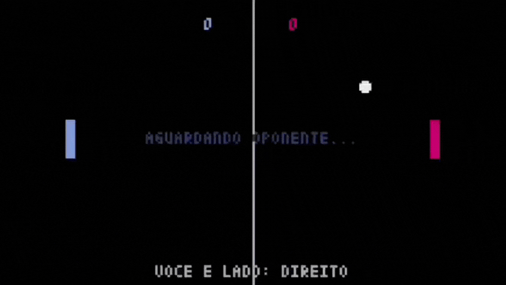

# pong-multiplayer 🎮

Um jogo de Pong clássico com modo multiplayer online via **UDP**, desenvolvido em Python com a biblioteca **Pyxel**.



## Sobre o Projeto

Este projeto foi desenvolvido como parte da disciplina de Redes de Computadores. O objetivo é aplicar conceitos de comunicação via Sockets, lidando com a natureza não confiável do protocolo UDP para garantir uma experiência de jogo em tempo real.

* 🌐 **Multiplayer Real-time:** Comunicação cliente-servidor via UDP.
* ⚡ **Baixa Latência:** Otimizado para reduzir o *jitter* e o atraso nas raquetes.
* 🎨 **Visual Retrô:** Estética 8-bit utilizando Pyxel.

## Estrutura do Projeto

```text
pong-multiplayer/
├── game.py           # Interface gráfica e lógica do jogo (Pyxel)
├── servidor.py       # Servidor centralizador das posições
├── cliente.py        # Lógica de conexão e troca de dados
└── game.pyxres       # Assets (sons e sprites)

```

## Requisitos

* Python 3.8+
* Pyxel 1.9.0+

## Instalação e Execução

1. **Clone o repositório:**
```bash
git clone https://github.com/marianinhaUFMT/pong-multiplayer.git
cd pong-multiplayer

```


2. **Instale as dependências:**
```bash
pip install pyxel

```


3. **Inicie o Servidor:**
Antes dos jogadores entrarem, o host deve rodar o servidor:
```bash
python servidor.py

```


4. **Inicie os Clientes:**
Em terminais diferentes (ou computadores na mesma rede):
```bash
python game.py

```


## Configuração de Rede

Para jogar em computadores diferentes na rede:

1. Verifique seu IP privado com o comando `ip a` (ex: `10.1.40.139`).
2. Os jogadores devem informar esse IP pelo terminal ao rodar `game.py`.
3. Certifique-se de que a porta UDP escolhida (ex: `5555`) não está bloqueada pelo firewall.

## Como Jogar

**Controles:**

* **W / S ou UP / DOWN:** Move as raquetes.
* **SPACE:** Reinicia a aplicação.
* **ESC:** Finaliza a aplicação.

## Autores

* **Mariana Sanchez Pedroni**
* **Anna Bheatryz Martins dos Santos**
